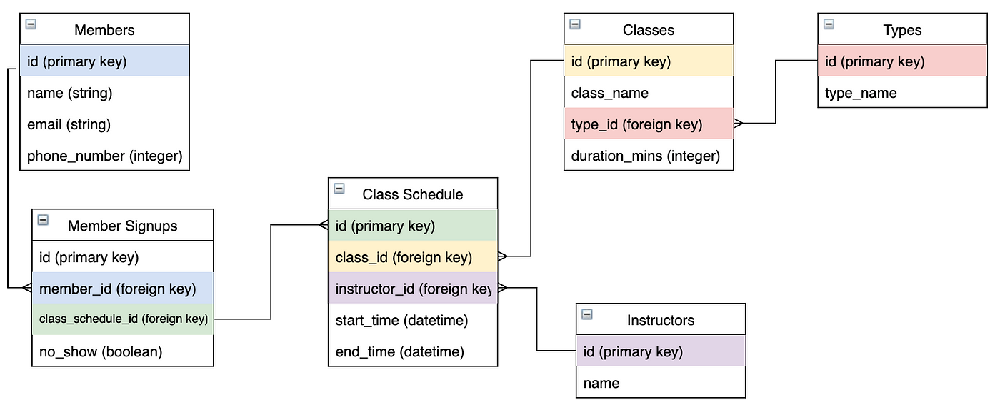

# **Théorie : Modèle Relationnel avec Microsoft SQL Server – Concepts et Pratique**

---

<div align="center">
  
  <p></p>
</div>

---

## **1. Introduction au Modèle Relationnel**

### **1.1 Historique**

- Le modèle relationnel a été introduit par **Edgar F. Codd** en 1970 dans un article intitulé *"A Relational Model of Data for Large Shared Data Banks"*.
- Il repose sur la **théorie des ensembles** et sur la **logique de prédicats**, ce qui le rend fondé sur des bases mathématiques solides.

### **1.2 Objectifs du Modèle Relationnel**

1. **Organisation logique** : Permet une structuration des données compréhensible, évolutive et cohérente.
2. **Indépendance des données** : Sépare la manière dont les données sont stockées physiquement de la manière dont elles sont manipulées logiquement.
3. **Réduction de la redondance** : Minimiser les duplications d'informations grâce à la normalisation.
4. **Manipulation uniforme** : Toutes les données sont accessibles via un langage unique et standardisé, comme **Transact-SQL (T-SQL)** dans le cas de Microsoft SQL Server.

---

## **2. Composants du Modèle Relationnel**

### **2.1 Les Tables (Relations)**

Une **relation** est une table contenant des données. Elle est définie par :

1. **Un schéma relationnel** : La structure de la table (noms des colonnes et leurs types).
2. **Un ensemble de tuples** : Les lignes de la table.

**Exemple de table : Clients**

| ID_Client | Nom        | Adresse          | Téléphone     |
|-----------|------------|------------------|---------------|
| 1         | Alice      | 12, Rue de Paris | 0600000001    |
| 2         | Bob        | 45, Av. des Fleurs | 0600000002 |

### **2.2 Les Attributs**

- Un **attribut** correspond à une colonne de la table.
- Chaque attribut a un **nom** et un **type de données** (entier, texte, date, etc.).
- **Exemple :** Dans la table **Clients**, "Nom" est un attribut de type texte.

### **2.3 Les Clés**

#### **2.3.1 Clé Primaire (Primary Key)**

- Identifie **de manière unique** chaque ligne d’une table.
- Une clé primaire ne peut pas contenir de valeurs NULL.
- **Exemple :** "ID_Client" est une clé primaire pour la table "Clients".

#### **2.3.2 Clé Étrangère (Foreign Key)**

- Relie une table à une autre en référant à une clé primaire.
- **Exemple :** Dans la table **Commandes**, "ID_Client" est une clé étrangère pointant vers la table **Clients**.

#### **2.3.3 Clé Candidat**

- Un attribut ou un ensemble minimal d’attributs pouvant servir de clé primaire.

#### **2.3.4 Clé Composite**

- Une clé primaire constituée de **plusieurs attributs**.
- **Exemple :** Dans une table "Inscription", une clé composite pourrait être "ID_Étudiant" et "ID_Cours".

---

## **3. Intégrité dans le Modèle Relationnel**

### **3.1 Règles d’Intégrité**

1. **Intégrité d’entité** : Chaque table doit avoir une clé primaire, et ses valeurs doivent être uniques et non NULL.
2. **Intégrité référentielle** : Une clé étrangère doit correspondre à une clé primaire existante dans une autre table ou être NULL.

### **3.2 Exemple**

**Clients**

| ID_Client | Nom        |
|-----------|------------|
| 1         | Alice      |
| 2         | Bob        |

**Commandes**

| ID_Commande | ID_Client | Date       |
|-------------|-----------|------------|
| 101         | 1         | 2024-01-15 |
| 102         | 2         | 2024-01-16 |

- La valeur "ID_Client" dans **Commandes** doit exister dans **Clients**.

---

## **4. Normalisation des Données**

### **4.1 Objectif de la Normalisation**

- Éviter la **redondance** et les **anomalies** (insertion, suppression, mise à jour).
- Assurer une **organisation cohérente** des données.

### **4.2 Les Formes Normales**
#### **Première Forme Normale (1NF)**

- Les données doivent être **atomiques** (pas de listes ou d’ensembles dans une cellule).
- Exemple (non conforme à 1NF) :

| Nom  | Téléphones           |
|------|----------------------|
| Alice | 0600000001, 0600000002 |

  Après normalisation :

| Nom  | Téléphone   |
|------|-------------|
| Alice | 0600000001 |
| Alice | 0600000002 |

#### **Deuxième Forme Normale (2NF)**

- Toutes les colonnes non-clés doivent dépendre **entièrement** de la clé primaire.

#### **Troisième Forme Normale (3NF)**

- Aucune colonne ne doit dépendre d’une colonne non-clé (pas de dépendance transitive).

---

## **5. Les Opérations Relationnelles avec T-SQL**

### **5.1 Sélection (Restriction)**

- Extrait des lignes spécifiques en fonction d’une condition.

```sql
SELECT * FROM Clients WHERE Ville = 'Paris';
```

### **5.2 Projection**

- Extrait certaines colonnes d’une table.

```sql
SELECT Nom, Adresse FROM Clients;
```

### **5.3 Jointure**

- Combine des données provenant de plusieurs tables.

```sql
SELECT Clients.Nom, Commandes.Date 
FROM Clients 
JOIN Commandes ON Clients.ID_Client = Commandes.ID_Client;
```

---

## **6. Exemple Pratique**

### **6.1 Schéma de Base**

**Tables :**

1. **Clients**

| ID_Client | Nom    | Ville    |
|-----------|--------|----------|
| 1         | Alice  | Paris    |
| 2         | Bob    | Lyon     |

2. **Commandes**

| ID_Commande | ID_Client | Montant |
|-------------|-----------|---------|
| 101         | 1         | 150.00  |
| 102         | 2         | 200.00  |

### **6.2 Requêtes**

#### **Lister les commandes des clients de Paris :**

```sql
SELECT Clients.Nom, Commandes.Montant 
FROM Clients 
JOIN Commandes ON Clients.ID_Client = Commandes.ID_Client 
WHERE Clients.Ville = 'Paris';
```

#### **Total des montants par client :**

```sql
SELECT Clients.Nom, SUM(Commandes.Montant) AS Total 
FROM Clients 
JOIN Commandes ON Clients.ID_Client = Commandes.ID_Client 
GROUP BY Clients.Nom;
```

---

## **7. Conclusion**

- Le modèle relationnel, avec Microsoft SQL Server, constitue une base solide pour gérer les bases de données.
- Une bonne compréhension des concepts (tables, clés, normalisation) est essentielle pour structurer efficacement des données.
- Les outils comme **SQL Server Management Studio (SSMS)** rendent la gestion des bases intuitive et puissante.

---

## **8. Exercices**

# 8.1. Transformation du Modèle Entité-Association en Modèle Relationnel

Ce fichier contient des exercices pour transformer des modèles entité-association (E-A) en modèles relationnels, accompagnés de solutions détaillées.

---

## Exercice 1 : Modèle simple

### Modèle E-A

- Entité : **Étudiant** (Attributs : ID_Étudiant, Nom, Prénom)
- Entité : **Cours** (Attributs : Code_Cours, Nom_Cours)
- Relation : **S'inscrit** (Attributs : Date_Inscription) entre **Étudiant** et **Cours**

### Solution

**Tables relationnelles :**

1. **Étudiant**

   - ID_Étudiant (PK)
   - Nom
   - Prénom

2. **Cours**

   - Code_Cours (PK)
   - Nom_Cours

3. **Inscription**

   - ID_Étudiant (FK)
   - Code_Cours (FK)
   - Date_Inscription
   - **Clé primaire composite : (ID_Étudiant, Code_Cours)**

---

## Exercice 2 : Modèle avec relations N:N

### Modèle E-A

- Entité : **Auteur** (Attributs : ID_Auteur, Nom, Nationalité)
- Entité : **Livre** (Attributs : ISBN, Titre, Genre)
- Relation : **Écrit** entre **Auteur** et **Livre** (relation N:N)

### Solution

**Tables relationnelles :**

1. **Auteur**

   - ID_Auteur (PK)
   - Nom
   - Nationalité

2. **Livre**

   - ISBN (PK)
   - Titre
   - Genre

3. **Écrit**

   - ID_Auteur (FK)
   - ISBN (FK)
   - **Clé primaire composite : (ID_Auteur, ISBN)**

---

## Exercice 3 : Hiérarchie d'entités

### Modèle E-A

- Entité : **Personne** (Attributs : ID, Nom, Adresse)

  - Sous-entité : **Employé** (Attributs : Salaire, Poste)
  - Sous-entité : **Client** (Attributs : Date_Adhésion, Catégorie_Client)

### Solution

**Tables relationnelles :**

1. **Personne**

   - ID (PK)
   - Nom
   - Adresse

2. **Employé** (hérite de Personne)

   - ID (PK, FK vers Personne)
   - Salaire
   - Poste

3. **Client** (hérite de Personne)

   - ID (PK, FK vers Personne)
   - Date_Adhésion
   - Catégorie_Client

---

## Exercice 4 : Relation ternaire

### Modèle E-A

- Entité : **Élève** (Attributs : ID_Élève, Nom)
- Entité : **Professeur** (Attributs : ID_Professeur, Nom)
- Entité : **Matière** (Attributs : Code_Matière, Nom_Matière)
- Relation : **Évaluation** (Attributs : Note, Date) entre **Élève**, **Professeur**, et **Matière**

### Solution

**Tables relationnelles :**

1. **Élève**

   - ID_Élève (PK)
   - Nom

2. **Professeur**
   
   - ID_Professeur (PK)
   - Nom

3. **Matière**
   
   - Code_Matière (PK)
   - Nom_Matière

4. **Évaluation**
   
   - ID_Élève (FK)
   - ID_Professeur (FK)
   - Code_Matière (FK)
   - Note
   - Date
   - **Clé primaire composite : (ID_Élève, ID_Professeur, Code_Matière)**

---

## Exercice 5 : Modèle complexe

### Modèle E-A

- Entité : **Client** (Attributs : ID_Client, Nom, Adresse)
- Entité : **Commande** (Attributs : ID_Commande, Date_Commande)
- Entité : **Produit** (Attributs : Code_Produit, Nom_Produit, Prix)
- Relation : **Passe** entre **Client** et **Commande** (relation 1:N)
- Relation : **Contient** entre **Commande** et **Produit** (relation N:N avec attribut Quantité)

### Solution

**Tables relationnelles :**

1. **Client**

   - ID_Client (PK)
   - Nom
   - Adresse

2. **Commande**

   - ID_Commande (PK)
   - Date_Commande
   - ID_Client (FK)

3. **Produit**

   - Code_Produit (PK)
   - Nom_Produit
   - Prix

4. **Contient**

   - ID_Commande (FK)
   - Code_Produit (FK)
   - Quantité
   - **Clé primaire composite : (ID_Commande, Code_Produit)**

---

# 8.2. Exercices sur les Formes Normales


Cette série d'exercices vous permettra pour comprendre les différentes formes normales **(1NF, 2NF, 3NF, BCNF)**.

---

## Exercice 1 : Première Forme Normale (1NF)

### Table initiale :

| Client_ID | Nom       | Téléphones         |
|-----------|-----------|--------------------|
| 1         | Dupont    | 123456, 7891011    |
| 2         | Martin    | 987654             |
| 3         | Durand    | 112233, 445566, 778899 |

### Questions :

1. Cette table est-elle en **1NF** ? Pourquoi ?
2. Si elle ne l’est pas, réorganise-la pour qu’elle soit conforme à la **1NF**.

### Solution :

- Non, cette table n'est pas en 1NF car l’attribut **Téléphones** contient plusieurs valeurs par enregistrement.  
- Réorganisation en 1NF :

| Client_ID | Nom       | Téléphone |
|-----------|-----------|-----------|
| 1         | Dupont    | 123456    |
| 1         | Dupont    | 7891011   |
| 2         | Martin    | 987654    |
| 3         | Durand    | 112233    |
| 3         | Durand    | 445566    |
| 3         | Durand    | 778899    |

---

## Exercice 2 : Deuxième Forme Normale (2NF)

### Table initiale (en 1NF) :

| Commande_ID | Produit_ID | Nom_Produit | Prix_Produit | Quantité | Total_Commande |
|-------------|------------|-------------|--------------|----------|----------------|
| 1           | A1         | Pomme       | 2            | 5        | 10             |
| 1           | A2         | Orange      | 3            | 2        | 6              |
| 2           | A1         | Pomme       | 2            | 10       | 20             |

### Questions :

1. Cette table est-elle en **2NF** ? Pourquoi ?
2. Si elle ne l’est pas, décompose-la en plusieurs tables conformes à la **2NF**.

### Solution :

- Non, cette table n’est pas en **2NF** car **Nom_Produit** et **Prix_Produit** dépendent seulement de **Produit_ID** et non de la clé composée (**Commande_ID**, **Produit_ID**).
- Réorganisation en 2NF :

1. **Commande_Produit** :

   | Commande_ID | Produit_ID | Quantité |
   |-------------|------------|----------|
   | 1           | A1         | 5        |
   | 1           | A2         | 2        |
   | 2           | A1         | 10       |

2. **Produit** :

   | Produit_ID | Nom_Produit | Prix_Produit |
   |------------|-------------|--------------|
   | A1         | Pomme       | 2            |
   | A2         | Orange      | 3            |

3. **Commande** :

   | Commande_ID | Total_Commande |
   |-------------|----------------|
   | 1           | 10             |
   | 2           | 20             |

---

## Exercice 3 : Troisième Forme Normale (3NF)

### Table initiale :

| Étudiant_ID | Nom_Étudiant | Adresse     | Ville        | Code_Postal |
|-------------|--------------|-------------|--------------|-------------|
| 1           | Alice        | Rue A       | Paris        | 75001       |
| 2           | Bob          | Rue B       | Lyon         | 69001       |
| 3           | Alice        | Rue C       | Paris        | 75001       |

### Questions :

1. Cette table est-elle en **3NF** ? Pourquoi ?
2. Si elle ne l’est pas, réorganise-la pour qu’elle soit conforme à la 3NF.

### Solution :

- Non, cette table n'est pas en **3NF** car **Ville** dépend fonctionnellement de **Code_Postal**, et non de la clé primaire **Étudiant_ID**.
- Réorganisation en **3NF** :

1. **Étudiant** :

   | Étudiant_ID | Nom_Étudiant | Adresse | Code_Postal |
   |-------------|--------------|---------|-------------|
   | 1           | Alice        | Rue A   | 75001       |
   | 2           | Bob          | Rue B   | 69001       |
   | 3           | Alice        | Rue C   | 75001       |

2. **Code_Postal_Ville** :

   | Code_Postal | Ville  |
   |-------------|--------|
   | 75001       | Paris  |
   | 69001       | Lyon   |

---

## Exercice 4 : Forme Normale de Boyce-Codd (BCNF)

### Table initiale :

| Professeur | Matière     | Salle      |
|------------|-------------|------------|
| Dupont     | Mathématiques | A101      |
| Dupont     | Informatique | B202      |
| Martin     | Mathématiques | A101      |

### Questions :

1. Cette table est-elle en **BCNF** ? Pourquoi ?
2. Si elle ne l’est pas, décompose-la en plusieurs tables conformes à la **BCNF**.

### Solution :

- Non, cette table n'est pas en **BCNF** car **Salle** dépend fonctionnellement de **Matière**, et non uniquement de la clé primaire (**Professeur**, **Matière**).
- Réorganisation en **BCNF** :

1. **Professeur_Matière** :
   
   | Professeur | Matière     |
   |------------|-------------|
   | Dupont     | Mathématiques |
   | Dupont     | Informatique |
   | Martin     | Mathématiques |

2. **Matière_Salle** :
   
   | Matière     | Salle  |
   |-------------|--------|
   | Mathématiques | A101  |
   | Informatique | B202  |

---

## Exercice 5 : Général

### Table initiale :

| Commande_ID | Client_ID | Nom_Client | Produit_ID | Nom_Produit | Prix | Quantité |
|-------------|-----------|------------|------------|-------------|------|----------|
| 1           | 101       | Alice      | P1         | Pomme       | 2    | 5        |
| 1           | 101       | Alice      | P2         | Orange      | 3    | 2        |
| 2           | 102       | Bob        | P1         | Pomme       | 2    | 10       |

### Questions :

1. Identifiez les anomalies possibles.
2. Appliquez les transformations nécessaires pour arriver jusqu’à la **BCNF**.

### Solution

- **Problèmes identifiés** :
 
  - **Nom_Client** dépend uniquement de **Client_ID**.
  - **Nom_Produit** et **Prix** dépendent uniquement de **Produit_ID**.
  - Il y a des données redondantes.

- **Réorganisation en BCNF** :

1. **Client** :
   
   | Client_ID | Nom_Client |
   |-----------|------------|
   | 101       | Alice      |
   | 102       | Bob        |

2. **Produit** :
   
   | Produit_ID | Nom_Produit | Prix |
   |------------|-------------|------|
   | P1         | Pomme       | 2    |
   | P2         | Orange      | 3    |

3. **Commande_Produit** :
   
   | Commande_ID | Produit_ID | Quantité |
   |-------------|------------|----------|
   | 1           | P1         | 5        |
   | 1           | P2         | 2        |
   | 2           | P1         | 10       |

4. **Commande** :
   
   | Commande_ID | Client_ID |
   |-------------|-----------|
   | 1           | 101       |
   | 2           | 102       |

---
